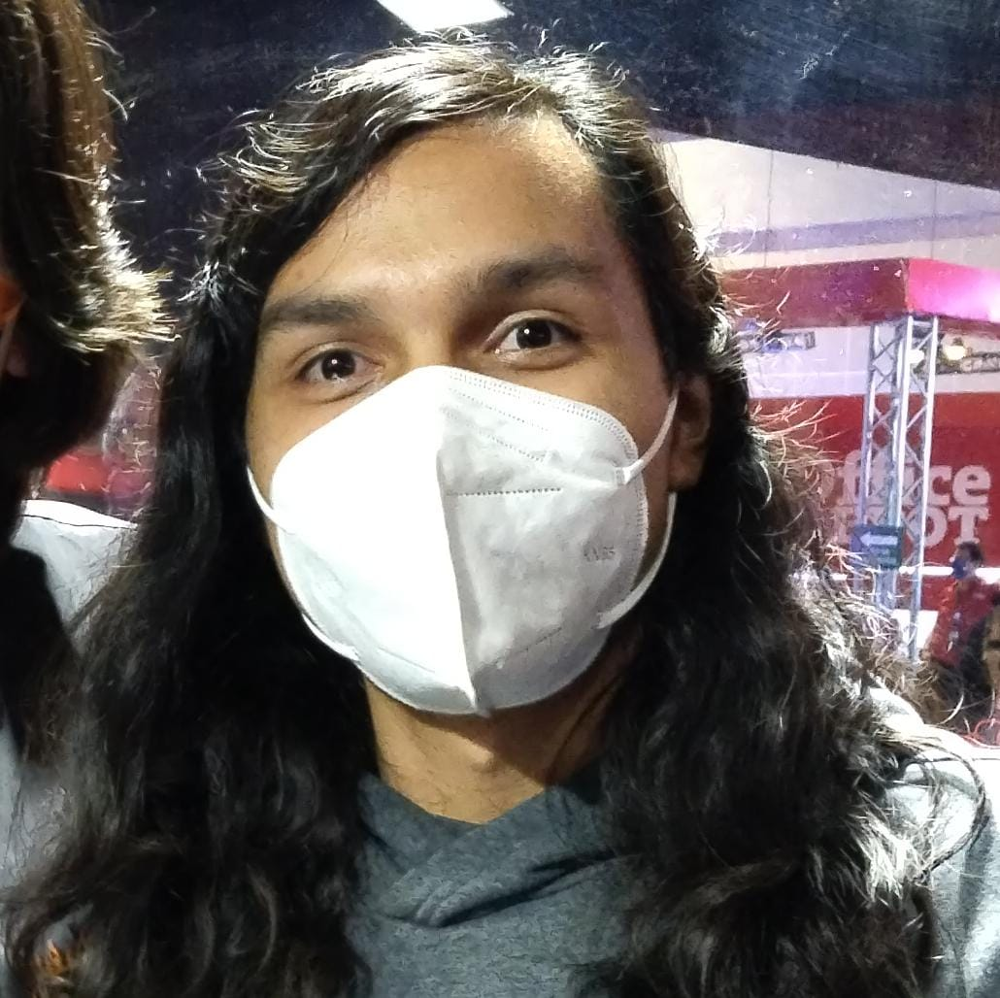

# Amaury Flores Estudillo 
**Edad:** 20 años

## Presentación

Soy un estudiante de nivel universidad que actualmente resido en CDMX, estoy estudando la carrera de _Ingeniería en Software Interactivo y Videojuegos_ en **Amerike**, me gusta bastante jugar videojuegos y la música, en el pasado practiqué durante 10 años TaeKwonDo, y estuve en un equipo de Basketball unos 3 años, llegue a ser cinta negra e impartir clases de TaeKwonDo como un tipo de serivicio social

## ¿Porqué eligí esta carrera?

Buscando diversas carreras encontre primero _Ingeniería en Sistemas Computacionales_ en [**UNITEC**](https://www.unitec.mx/), pero ya había acabo un semtre y todavía estaba muy lejos de empezar a ver programación, buscando otra carrera, encontre la carrera _Ingeniería en Software Interactivo y Videojuegos_ en [**Amerike**](https://amerike.edu.mx/), la cual me llamo bastante la antención por el hecho que desde el primer semestre se empieza a ver el tema.

## ¿En que espero trabajar?

Espero poder trabajar en algo relacionado ya sea a la informática o los videojuegos, aunque de ser posible, siempre optaría por algo relacionado al tema de los videojuegos, ya sea trabajando en algún estudio de creación de videojuegos, o similar.

## Pasatiempos

| Pasatiempo | Motivo | 
|-|-|
| jugar videojuegos | Desde hace bastante tiempo que he disfrutadoo de jugar todo tipo de videjuegos, y siempre me gusta aprender atrvez de ellos
| Practicar un instrumento | Desde pequeño me gusta bastante el tocar todo tipo de instrumentos, ya que es una manera de expreción y tambien me permite tocar canciones de mis juegos favoritos |
| Hacer videos | Desde hace basatnte que me gusta lo de crear contenido, ya que se me hace algo divertido que disfruto bastante | 
|Ver anime | Es algo que suelo ver de vez en cuando, y en especial cuando sale una serie que estaba esperando o volver a ver los animes que ya vi

### Datos de contacto:
- Twitter: amwichy
- Youtube: amauryf
- itchio: amwichy
- correo: cdmx2472@amerike.edu.mx

